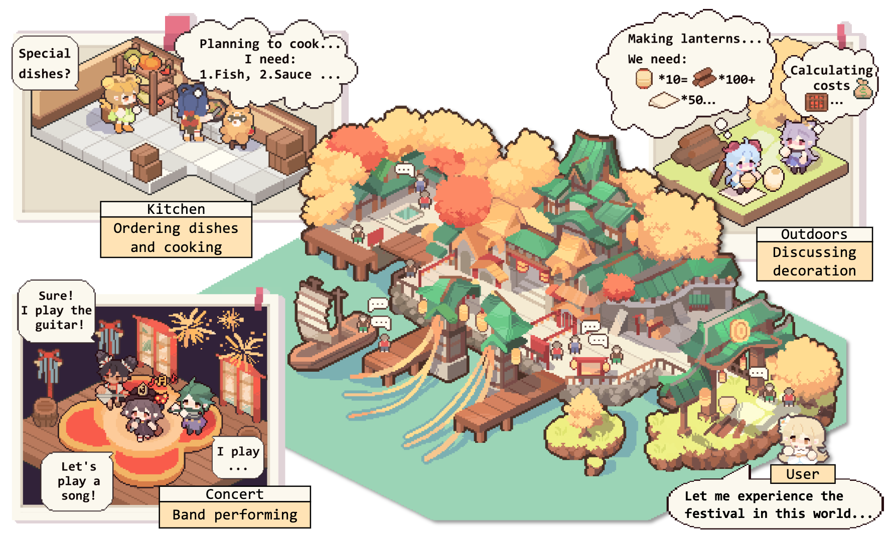
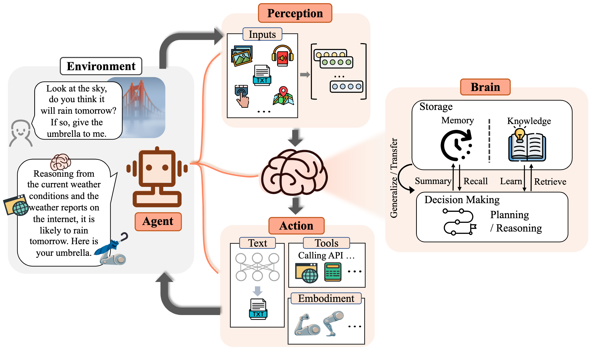
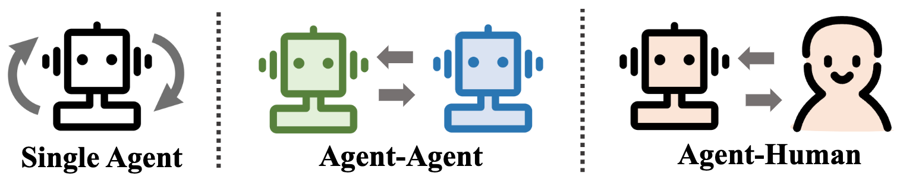
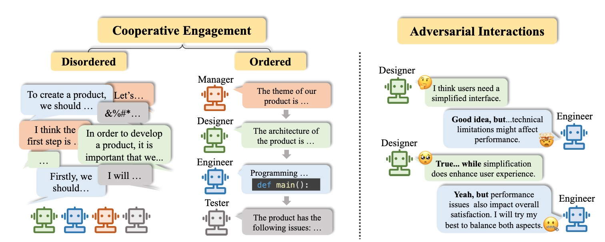
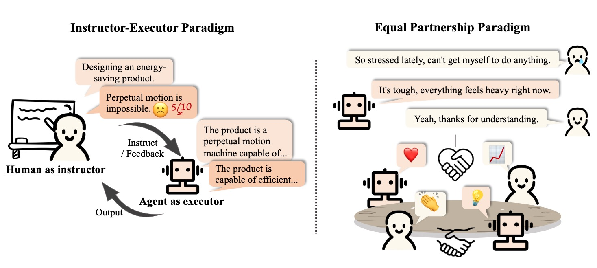
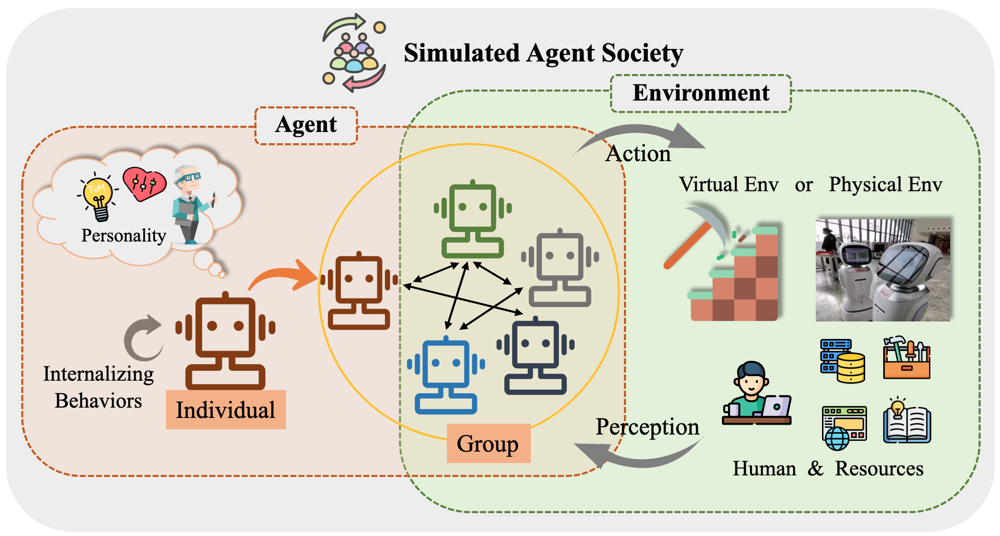

# The Rise and Potential of Large Language Model Based Agents: A Survey

🔥 **Must-read papers for LLM-based agents.**

🏃 **Coming soon: Add one-sentence intro to each paper.**

## 🔔 News
- 💫 [2023/02/08] New paper R3 on RL for LLM agent reasoning has been released! Paper: [Training Large Language Models for Reasoning through Reverse Curriculum Reinforcement Learning](https://arxiv.org/abs/2402.05808). Codes: [LLM-Reverse-Curriculum-RL](https://github.com/WooooDyy/LLM-Reverse-Curriculum-RL).
- 🥳 [2023/09/20] This project has been listed on [GitHub Trendings](https://github.com/trending)!  It is a great honor!
- 💥 [2023/09/15] Our survey is released! See [The Rise and Potential of Large Language Model Based Agents: A Survey](https://arxiv.org/abs/2309.07864) for the paper!
- ✨ [2023/09/14] We create this repository to maintain a paper list on LLM-based agents. More papers are coming soon!

<div align=center></div>


## 🌟 Introduction

For a long time, humanity has pursued artificial intelligence (AI) equivalent to or surpassing human level, with AI agents considered as a promising vehicle of this pursuit. AI agents are artificial entities that sense their environment, make decisions, and take actions. 

Due to the versatile and remarkable capabilities they demonstrate, large language models (LLMs) are regarded as potential sparks for Artificial General Intelligence (AGI), offering hope for building general AI agents. Many research efforts have leveraged LLMs as the foundation to build AI agents and have achieved significant progress.

In this repository, we provide a systematic and comprehensive survey on LLM-based agents, and list some must-read papers. 

Specifically, we start by the general conceptual framework for LLM-based agents: comprising three main components: brain, perception, and action, and the framework can be tailored to suit different applications. 
Subsequently, we explore the extensive applications of LLM-based agents in three aspects: single-agent scenarios, multi-agent scenarios, and human-agent cooperation. 
Following this, we delve into agent societies, exploring the behavior and personality of LLM-based agents, the social phenomena that emerge when they form societies, and the insights they offer for human society.
Finally, we discuss a range of key topics and open problems within the field.

**We greatly appreciate any contributions via PRs, issues, emails, or other methods.**

## Table of Content (ToC)


- [The Rise and Potential of Large Language Model Based Agents: A Survey](#the-rise-and-potential-of-large-language-model-based-agents-a-survey)
  - [🔔 News](#-news)
  - [🌟 Introduction](#-introduction)
  - [Table of Content (ToC)](#table-of-content-toc)
  - [1. The Birth of An Agent: Construction of LLM-based Agents](#1-the-birth-of-an-agent-construction-of-llm-based-agents)
    - [1.1 Brain: Primarily Composed of An LLM](#11-brain-primarily-composed-of-an-llm)
      - [1.1.1 Natural Language Interaction](#111-natural-language-interaction)
        - [High-quality generation](#high-quality-generation)
        - [Deep understanding](#deep-understanding)
      - [1.1.2 Knowledge](#112-knowledge)
        - [Pretrain model](#pretrain-model)
        - [Linguistic knowledge](#linguistic-knowledge)
        - [Commonsense knowledge](#commonsense-knowledge)
        - [Actionable knowledge](#actionable-knowledge)
        - [Potential issues of knowledge](#potential-issues-of-knowledge)
      - [1.1.3 Memory](#113-memory)
        - [Memory capability](#memory-capability)
          - [Raising the length limit of Transformers](#raising-the-length-limit-of-transformers)
          - [Summarizing memory](#summarizing-memory)
          - [Compressing memories with vectors or data structures](#compressing-memories-with-vectors-or-data-structures)
        - [Memory retrieval](#memory-retrieval)
      - [1.1.4 Reasoning \& Planning](#114-reasoning--planning)
        - [Reasoning](#reasoning)
        - [Planning](#planning)
          - [Plan formulation](#plan-formulation)
          - [Plan reflection](#plan-reflection)
      - [1.1.5 Transferability and Generalization](#115-transferability-and-generalization)
        - [Unseen task generalization](#unseen-task-generalization)
        - [In-context learning](#in-context-learning)
        - [Continual learning](#continual-learning)
    - [1.2 Perception: Multimodal Inputs for LLM-based Agents](#12-perception-multimodal-inputs-for-llm-based-agents)
      - [1.2.1 Visual](#121-visual)
      - [1.2.2 Audio](#122-audio)
    - [1.3 Action: Expand Action Space of LLM-based Agents](#13-action-expand-action-space-of-llm-based-agents)
      - [1.3.1 Tool Using](#131-tool-using)
      - [1.3.2 Embodied Action](#132-embodied-action)
  - [2. Agents in Practice: Applications of LLM-based Agents](#2-agents-in-practice-applications-of-llm-based-agents)
    - [2.1 General Ability of Single Agent](#21-general-ability-of-single-agent)
      - [2.1.1 Task-oriented Deployment](#211-task-oriented-deployment)
      - [2.1.2 Innovation-oriented Deployment](#212-innovation-oriented-deployment)
      - [2.1.3 Lifecycle-oriented Deployment](#213-lifecycle-oriented-deployment)
    - [2.2 Coordinating Potential of Multiple Agents](#22-coordinating-potential-of-multiple-agents)
      - [2.2.1 Cooperative Interaction for Complementarity](#221-cooperative-interaction-for-complementarity)
      - [2.2.2 Adversarial Interaction for Advancement](#222-adversarial-interaction-for-advancement)
    - [2.3 Interactive Engagement between Human and Agent](#23-interactive-engagement-between-human-and-agent)
      - [2.3.1 Instructor-Executor Paradigm](#231-instructor-executor-paradigm)
        - [Education](#education)
        - [Health](#health)
        - [Other Application](#other-application)
      - [2.3.2 Equal Partnership Paradigm](#232-equal-partnership-paradigm)
        - [Empathetic Communicator](#empathetic-communicator)
        - [Human-Level Participant](#human-level-participant)
  - [3. Agent Society: From Individuality to Sociality](#3-agent-society-from-individuality-to-sociality)
    - [3.1 Behavior and Personality of LLM-based Agents](#31-behavior-and-personality-of-llm-based-agents)
      - [3.1.1 Social Behavior](#311-social-behavior)
        - [Individual behaviors](#individual-behaviors)
        - [Group behaviors](#group-behaviors)
      - [3.1.2 Personality](#312-personality)
        - [Cognition](#cognition)
        - [Emotion](#emotion)
        - [Character](#character)
    - [3.2 Environment for Agent Society](#32-environment-for-agent-society)
      - [3.2.1 Text-based Environment](#321-text-based-environment)
      - [3.2.2 Virtual Sandbox Environment](#322-virtual-sandbox-environment)
      - [3.2.3 Physical Environment](#323-physical-environment)
    - [3.3 Society Simulation with LLM-based Agents](#33-society-simulation-with-llm-based-agents)
  - [4. Agent Benchmark: Assessment the capabilities of LLM-powered Agent](#4-agent-benchmark-assessment-the-capabilities-of-LLM-powered-agent)
  - [Citation](#citation)
  - [Project Maintainers \& Contributors](#project-maintainers--contributors)
  - [Contact](#contact)
  - [Star History](#star-history)


## 1. The Birth of An Agent: Construction of LLM-based Agents
<div align=center></div>

### 1.1 Brain: Primarily Composed of An LLM

#### 1.1.1 Natural Language Interaction

##### High-quality generation


- [2023/10] **Towards End-to-End Embodied Decision Making via Multi-modal Large Language Model: Explorations with GPT4-Vision and Beyond** *Liang Chen et al. arXiv.* [[paper](https://arxiv.org/abs/2310.02071)] [[code](https://github.com/PKUnlp-icler/PCA-EVAL)]
  - This work proposes PCA-EVAL, which benchmarks embodied decision making via MLLM-based End-to-End method and LLM-based Tool-Using methods from Perception, Cognition and Action Levels.
- [2023/08] **A Multitask, Multilingual, Multimodal Evaluation of ChatGPT on Reasoning, Hallucination, and Interactivity.** *Yejin Bang et al. arXiv.* [[paper](https://doi.org/10.48550/arXiv.2302.04023)]
  - This work evaluates the multitask, multilingual and multimodal aspects of ChatGPT using 21 data sets covering 8 different common NLP application tasks.
- [2023/06] **LLM-Eval: Unified Multi-Dimensional Automatic Evaluation for Open-Domain Conversations with Large Language Models.** *Yen-Ting Lin et al. arXiv.* [[paper](https://doi.org/10.48550/arXiv.2305.13711)]
  - The LLM-EVAL method evaluates multiple dimensions of evaluation, such as content, grammar, relevance, and appropriateness.
- [2023/04] **Is ChatGPT a Highly Fluent Grammatical Error Correction System? A Comprehensive Evaluation.** *Tao Fang et al. arXiv.* [[paper](https://doi.org/10.48550/arXiv.2304.01746)]
  - The results of evaluation demonstrate that ChatGPT has excellent error detection capabilities and can freely correct errors to make the corrected sentences very fluent. Additionally, its performance in non-English and low-resource settings highlights its potential in multilingual GEC tasks.

##### Deep understanding

- [2023/06] **Clever Hans or Neural Theory of Mind? Stress Testing Social Reasoning in Large Language Models.** *Natalie Shapira et al. arXiv.* [[paper](https://doi.org/10.48550/arXiv.2305.14763)]
  - LLMs exhibit certain theory of mind abilities, but this behavior is far from being robust.
- [2022/08] **Inferring Rewards from Language in Context.** *Jessy Lin et al. ACL.* [[paper](https://doi.org/10.18653/v1/2022.acl-long.585)]
  - This work presents a model that infers rewards from language and predicts optimal actions in unseen environment.
- [2021/10] **Theory of Mind Based Assistive Communication in Complex Human Robot Cooperation.** *Moritz C. Buehler et al. arXiv.* [[paper](https://arxiv.org/abs/2109.01355)]
  - This work designs an agent Sushi with an understanding of the human during interaction.

#### 1.1.2 Knowledge

##### Pretrain model

- [2023/04] **Learning Distributed Representations of Sentences from Unlabelled Data.** *Felix Hill (University of Cambridge) et al. arXiv.* [[paper](https://arxiv.org/abs/1602.03483)]
- [2020/02] **How Much Knowledge Can You Pack Into the Parameters of a Language Model?** *Adam Roberts (Google) et al. arXiv.* [[paper](https://arxiv.org/abs/2002.08910)]
- [2020/01] **Scaling Laws for Neural Language Models.** *Jared Kaplan (Johns Hopkins University) et al. arXiv.* [[paper](https://arxiv.org/abs/2001.08361)]
- [2017/12] **Commonsense Knowledge in Machine Intelligence.** *Niket Tandon (Allen Institute for Artificial Intelligence) et al. SIGMOD.* [[paper](https://sigmodrecord.org/publications/sigmodRecord/1712/pdfs/09_reports_Tandon.pdf)]
- [2011/03] **Natural Language Processing (almost) from Scratch.** *Ronan Collobert (Princeton) et al. arXiv.* [[paper](https://arxiv.org/abs/1103.0398)]

##### Linguistic knowledge

- [2023/02] **A Multitask, Multilingual, Multimodal Evaluation of ChatGPT on Reasoning, Hallucination, and Interactivity.** *Yejin Bang et al. arXiv.* [[paper](https://arxiv.org/abs/2302.04023)]
- [2021/06] **Probing Pre-trained Language Models for Semantic Attributes and their Values.** *Meriem Beloucif et al. EMNLP.* [[paper](https://aclanthology.org/2021.findings-emnlp.218/)]
- [2020/10] **Probing Pretrained Language Models for Lexical Semantics.** *Ivan Vulić et al. arXiv.* [[paper](https://arxiv.org/abs/2010.05731)]
- [2019/04] **A Structural Probe for Finding Syntax in Word Representations.** *John Hewitt et al. ACL.* [[paper](https://aclanthology.org/N19-1419/)]
- [2016/04] **Improved Automatic Keyword Extraction Given More Semantic Knowledge.** *H Leung. Systems for Advanced Applications.* [[paper](https://link.springer.com/chapter/10.1007/978-3-319-32055-7_10)]

##### Commonsense knowledge

- [2022/10] **Language Models of Code are Few-Shot Commonsense Learners.** *Aman Madaan et al.arXiv.* [[paper](https://arxiv.org/abs/2210.07128)]
- [2021/04] **Relational World Knowledge Representation in Contextual Language Models: A Review.** *Tara Safavi et al. arXiv.* [[paper](https://arxiv.org/abs/2104.05837)]
- [2019/11] **How Can We Know What Language Models Know?** *Zhengbao Jiang et al.arXiv.* [[paper](https://arxiv.org/abs/1911.12543)]

##### Actionable knowledge

- [2023/07] **Large language models in medicine.** *Arun James Thirunavukarasu et al. nature.* [[paper](https://www.nature.com/articles/s41591-023-02448-8)]
- [2023/06] **DS-1000: A Natural and Reliable Benchmark for Data Science Code Generation.** *Yuhang Lai et al. ICML.* [[paper](https://proceedings.mlr.press/v202/lai23b.html)]
- [2022/10] **Language Models of Code are Few-Shot Commonsense Learners.** *Aman Madaan et al. arXiv.* [[paper](https://arxiv.org/abs/2210.07128)]
- [2022/02] **A Systematic Evaluation of Large Language Models of Code.** *Frank F. Xu et al.arXiv.* [[paper](https://arxiv.org/abs/2202.13169)]
- [2021/10] **Training Verifiers to Solve Math Word Problems.** *Karl Cobbe et al. arXiv.* [[paper](https://arxiv.org/abs/2110.14168)]

##### Potential issues of knowledge

- [2023/10] **FreshLLMs: Refreshing Large Language Models with Search Engine Augmentation.** *Tu Vu (Google) et al. arXiv* [[paper](https://arxiv.org/abs/2310.03214)] [[code](https://github.com/freshllms/freshqa)]
- [2023/05] **Editing Large Language Models: Problems, Methods, and Opportunities.** *Yunzhi Yao et al. arXiv.* [[paper](https://arxiv.org/abs/2305.13172)]
- [2023/05] **Self-Checker: Plug-and-Play Modules for Fact-Checking with Large Language Models.** *Miaoran Li et al. arXiv.* [[paper](https://arxiv.org/abs/2305.14623)]
- [2023/05] **CRITIC: Large Language Models Can Self-Correct with Tool-Interactive Critiquing.** *Zhibin Gou et al. arXiv.* [[paper](https://arxiv.org/abs/2305.11738)]
- [2023/04] **Tool Learning with Foundation Models.** *Yujia Qin et al. arXiv.* [[paper](https://arxiv.org/abs/2304.08354)]
- [2023/03] **SelfCheckGPT: Zero-Resource Black-Box Hallucination Detection for Generative Large Language Models.** *Potsawee Manakul et al. arXiv.* [[paper](https://arxiv.org/abs/2303.08896)]
- [2022/06] **Memory-Based Model Editing at Scale.** *Eric Mitchell et al. arXiv.* [[paper](https://arxiv.org/abs/2206.06520)]
- [2022/04] **A Review on Language Models as Knowledge Bases.** *Badr AlKhamissi et al.arXiv.* [[paper](https://arxiv.org/abs/2204.06031)]
- [2021/04] **Editing Factual Knowledge in Language Models.** *Nicola De Cao et al.arXiv.* [[paper](https://arxiv.org/abs/2104.08164)]
- [2017/08] **Measuring Catastrophic Forgetting in Neural Networks.** *Ronald Kemker et al.arXiv.* [[paper](https://arxiv.org/abs/1708.02072)]

#### 1.1.3 Memory

##### Memory capability

###### Raising the length limit of Transformers

- [2023/10] **MemGPT: Towards LLMs as Operating Systems.** *Charles Packer (UC Berkeley) et al. arXiv.* [[paper](https://arxiv.org/abs/2310.08560)] [[project page](https://memgpt.ai/)] [[code](https://github.com/cpacker/MemGPT)] [[dataset](https://huggingface.co/MemGPT)]
- [2023/05] **Randomized Positional Encodings Boost Length Generalization of Transformers.** *Anian Ruoss (DeepMind) et al. arXiv.* [[paper](https://arxiv.org/abs/2305.16843)] [[code](https://github.com/google-deepmind/randomized_positional_encodings)]
- [2023-03] **CoLT5: Faster Long-Range Transformers with Conditional Computation.** *Joshua Ainslie (Google Research) et al. arXiv.* [[paper](https://arxiv.org/abs/2303.09752)]
- [2022/03] **Efficient Classification of Long Documents Using Transformers.** *Hyunji Hayley Park (Illinois University) et al. arXiv.* [[paper](https://arxiv.org/abs/2203.11258)] [[code](https://github.com/amazon-science/efficient-longdoc-classification)]
- [2021/12] **LongT5: Efficient Text-To-Text Transformer for Long Sequences.** *Mandy Guo (Google Research) et al. arXiv.* [[paper](https://arxiv.org/abs/2112.07916)] [[code](https://github.com/google-research/longt5)]
- [2019/10] **BART: Denoising Sequence-to-Sequence Pre-training for Natural Language Generation, Translation, and Comprehension.** *Michael Lewis (Facebook AI) et al. arXiv.* [[paper](https://arxiv.org/abs/1910.13461)] [[code](https://github.com/huggingface/transformers/tree/main/src/transformers/models/bart)]

###### Summarizing memory

- [2023/10] **Walking Down the Memory Maze: Beyond Context Limit through Interactive Reading** *Howard Chen (Princeton University) et al. arXiv.* [[paper](https://arxiv.org/abs/2310.05029)]
- [2023/09] **Empowering Private Tutoring by Chaining Large Language Models** *Yulin Chen (Tsinghua University) et al. arXiv.* [[paper](https://arxiv.org/abs/2309.08112)]
- [2023/08] **ExpeL: LLM Agents Are Experiential Learners.** *Andrew Zhao (Tsinghua University) et al. arXiv.* [[paper](https://arxiv.org/abs/2308.10144)] [[code](https://github.com/Andrewzh112/ExpeL)]
- [2023/08] **ChatEval: Towards Better LLM-based Evaluators through Multi-Agent Debate.** *Chi-Min Chan (Tsinghua University) et al. arXiv.* [[paper](https://arxiv.org/abs/2308.07201)] [[code](https://github.com/thunlp/ChatEval)]
- [2023/05] **MemoryBank: Enhancing Large Language Models with Long-Term Memory.** *Wanjun Zhong (Harbin Institute of Technology) et al. arXiv.* [[paper](https://arxiv.org/abs/2305.10250)] [[code](https://github.com/zhongwanjun/memorybank-siliconfriend)]
- [2023/04] **Generative Agents: Interactive Simulacra of Human Behavior.** *Joon Sung Park (Stanford University) et al. arXiv.* [[paper](https://arxiv.org/abs/2304.03442)] [[code](https://github.com/joonspk-research/generative_agents)]
- [2023/04] **Unleashing Infinite-Length Input Capacity for Large-scale Language Models with Self-Controlled Memory System.** *Xinnian Liang (Beihang University) et al. arXiv.* [[paper](https://arxiv.org/abs/2304.13343)] [[code](https://github.com/wbbeyourself/scm4llms)]
- [2023/03] **Reflexion: Language Agents with Verbal Reinforcement Learning.** *Noah Shinn (Northeastern University) et al. arXiv.* [[paper](https://arxiv.org/abs/2303.11366)] [[code](https://github.com/noahshinn024/reflexion)]
- [2023/05] **RecurrentGPT: Interactive Generation of (Arbitrarily) Long Text.** *Wangchunshu Zhou (AIWaves) et al. arXiv.* [[paper](https://arxiv.org/pdf/2305.13304.pdf)] [[code](https://github.com/aiwaves-cn/RecurrentGPT)]


###### Compressing memories with vectors or data structures

- [2023/07] **Communicative Agents for Software Development.** *Chen Qian (Tsinghua University) et al. arXiv.* [[paper](https://arxiv.org/abs/2307.07924)] [[code](https://github.com/openbmb/chatdev)]
- [2023/06] **ChatDB: Augmenting LLMs with Databases as Their Symbolic Memory.** *Chenxu Hu (Tsinghua University) et al. arXiv.* [[paper](https://arxiv.org/abs/2306.03901)] [[code](https://github.com/huchenxucs/ChatDB)]
- [2023/05] **Ghost in the Minecraft: Generally Capable Agents for Open-World Environments via Large Language Models with Text-based Knowledge and Memory.** *Xizhou Zhu (Tsinghua University) et al. arXiv.* [[paper](https://arxiv.org/abs/2305.17144)] [[code](https://github.com/OpenGVLab/GITM)]
- [2023/05] **RET-LLM: Towards a General Read-Write Memory for Large Language Models.** *Ali Modarressi (LMU Munich) et al. arXiv.* [[paper](https://arxiv.org/abs/2305.14322)] [[code](https://github.com/tloen/alpaca-lora)]
- [2023/05] **RecurrentGPT: Interactive Generation of (Arbitrarily) Long Text.** *Wangchunshu Zhou (AIWaves) et al. arXiv.* [[paper](https://arxiv.org/pdf/2305.13304.pdf)] [[code](https://github.com/aiwaves-cn/RecurrentGPT)]

##### Memory retrieval

- [2023/08] **Memory Sandbox: Transparent and Interactive Memory Management for Conversational Agents.** *Ziheng Huang (University of California—San Diego) et al. arXiv.* [[paper](https://arxiv.org/abs/2308.01542)]
- [2023/08] **AgentSims: An Open-Source Sandbox for Large Language Model Evaluation.** *Jiaju Lin (PTA Studio) et al. arXiv.* [[paper](https://arxiv.org/abs/2308.04026)] [[project page](https://www.agentsims.com/)] [[code](https://github.com/py499372727/AgentSims/)]
- [2023/06] **ChatDB: Augmenting LLMs with Databases as Their Symbolic Memory.** *Chenxu Hu (Tsinghua University) et al. arXiv.* [[paper](https://arxiv.org/abs/2306.03901)] [[code](https://github.com/huchenxucs/ChatDB)]
- [2023/05] **MemoryBank: Enhancing Large Language Models with Long-Term Memory.** *Wanjun Zhong (Harbin Institute of Technology) et al. arXiv.* [[paper](https://arxiv.org/abs/2305.10250)] [[code](https://github.com/zhongwanjun/memorybank-siliconfriend)]
- [2023/04] **Generative Agents: Interactive Simulacra of Human Behavior.** *Joon Sung Park (Stanford) et al. arXiv.* [[paper](https://arxiv.org/abs/2304.03442)] [[code](https://github.com/joonspk-research/generative_agents)]
- [2023/05] **RecurrentGPT: Interactive Generation of (Arbitrarily) Long Text.** *Wangchunshu Zhou (AIWaves) et al. arXiv.* [[paper](https://arxiv.org/pdf/2305.13304.pdf)] [[code](https://github.com/aiwaves-cn/RecurrentGPT)]


#### 1.1.4 Reasoning & Planning

##### Reasoning
- [2024/02] **Training Large Language Models for Reasoning through Reverse Curriculum Reinforcement Learning.** *Zhiheng Xi (Fudan University) et al. arXiv.* [[paper](https://arxiv.org/abs/2402.05808)] [[Code](https://github.com/WooooDyy/LLM-Agent-Paper-List)]
- [2023/09] **ReConcile: Round-Table Conference Improves Reasoning via Consensus among Diverse LLMs.** *Justin Chih-Yao Chen (University of North Carolina at Chapel Hill) et al. arXiv.* [[paper](https://arxiv.org/pdf/2309.13007.pdf)] [[code](https://github.com/dinobby/ReConcile)]

- [2023/05] **Self-Polish: Enhance Reasoning in Large Language Models via Problem Refinement.** *Zhiheng Xi (Fudan University) et al. arXiv.* [[paper](https://arxiv.org/abs/2305.14497)] [[code](https://github.com/woooodyy/self-polish)]

- [2023-03] **Large Language Models are Zero-Shot Reasoners.** *Takeshi Kojima (The University of Tokyo) et al. arXiv.* [[paper](https://arxiv.org/abs/2205.11916)] [[code](https://github.com/kojima-takeshi188/zero_shot_cot)]

- [2023/03] **Self-Refine: Iterative Refinement with Self-Feedback.** *Aman Madaan (Carnegie Mellon University) et al. arXiv.* [[paper](https://arxiv.org/abs/2303.17651)] [[code](https://github.com/madaan/self-refine)]

- [2022/05] **Selection-Inference: Exploiting Large Language Models for Interpretable Logical Reasoning.** *Antonia Creswell (DeepMind) et al. arXiv.* [[paper](https://arxiv.org/abs/2205.09712)]

- [2022/03] **Self-Consistency Improves Chain of Thought Reasoning in Language Models.** *Xuezhi Wang (Google Research) et al. arXiv.* [[paper](https://arxiv.org/abs/2203.11171)] [[code](https://github.com/huggingface/transformers/tree/main/src/transformers/models/bart)]

- [2023/02] **Multimodal Chain-of-Thought Reasoning in Language Models.** *Zhuosheng Zhang (Shanghai Jiao Tong University) et al. arXiv.* [[paper](https://arxiv.org/abs/2302.00923)] [[code](https://github.com/amazon-science/mm-cot)]

- [2022/01] **Chain-of-Thought Prompting Elicits Reasoning in Large Language Models.** *Jason Wei (Google Research) et al. arXiv.* [[paper](https://arxiv.org/abs/2201.11903)]


##### Planning

###### Plan formulation

- [2023/11] **JARVIS-1: Open-world Multi-task Agents with Memory-Augmented Multimodal Language Models.** *ZiHao Wang (Peking University) et al. arXiv.* [[paper](https://arxiv.org/abs/2311.05997)] [[code](https://github.com/CraftJarvis/JARVIS-1)]
- [2023/10] **Language Agent Tree Search Unifies Reasoning Acting and Planning in Language Models.** *Andy Zhou (University of Illinois Urbana-Champaign) et al. arXiv.* [[paper](https://arxiv.org/abs/2310.04406)] [[project page](https://andyz245.github.io/LanguageAgentTreeSearch/)] [[code](https://github.com/andyz245/LanguageAgentTreeSearch/)]
- [2023/05] **Tree of Thoughts: Deliberate Problem Solving with Large Language Models.** *Shunyu Yao (Princeton University) et al. arXiv.* [[paper](https://arxiv.org/abs/2305.10601)] [[code](https://github.com/princeton-nlp/tree-of-thought-llm)]
- [2023/05] **Plan, Eliminate, and Track -- Language Models are Good Teachers for Embodied Agents.** *Yue Wu (Carnegie Mellon University) et al. arXiv.* [[paper](https://arxiv.org/abs/2305.02412)]
- [2023/05] **Reasoning with Language Model is Planning with World Model.** *Shibo Hao (UC San Diego) et al. arXiv.* [[paper](https://arxiv.org/abs/2305.14992)] [[code](https://github.com/Ber666/RAP)]
- [2023/05] **SwiftSage: A Generative Agent with Fast and Slow Thinking for Complex Interactive Tasks.** *Bill Yuchen Lin (Allen Institute for Artificial Intelligence) et al. arXiv.* [[paper](https://arxiv.org/abs/2305.17390)] [[code](https://github.com/yuchenlin/swiftsage)]
- [2023/04] **LLM+P: Empowering Large Language Models with Optimal Planning Proficiency.** *Bo Liu (University of Texas at Austin) et al. arXiv.* [[paper](https://arxiv.org/abs/2304.11477)] [[code](https://github.com/Cranial-XIX/llm-pddl)]
- [2023/03] **HuggingGPT: Solving AI Tasks with ChatGPT and its Friends in Hugging Face.** *Yongliang Shen (Microsoft Research Asia) et al. arXiv.* [[paper](https://arxiv.org/abs/2303.17580)] [[code](https://github.com/microsoft/JARVIS)]
- [2023/02] **Describe, Explain, Plan and Select: Interactive Planning with Large Language Models Enables Open-World Multi-Task Agents.** *ZiHao Wang (Peking University) et al. arXiv.* [[paper](https://arxiv.org/abs/2302.01560)] [[code](https://github.com/CraftJarvis/MC-Planner)]
- [2022/05] **Least-to-Most Prompting Enables Complex Reasoning in Large Language Models.** *Denny Zhou (Google Research) et al. arXiv.* [[paper](https://arxiv.org/abs/2205.10625)]
- [2022/05] **MRKL Systems: A modular, neuro-symbolic architecture that combines large language models, external knowledge sources and discrete reasoning.** *Ehud Karpas (AI21 Labs) et al. arXiv.* [[paper](https://arxiv.org/abs/2205.00445)]
- [2022/04] **Do As I Can, Not As I Say: Grounding Language in Robotic Affordances.** *Michael Ahn (Robotics at Google) et al. arXiv.* [[paper](https://arxiv.org/abs/2204.01691)]
- [2023/05] **Agents: An Open-source Framework for Autonomous Language Agents.** *Wangchunshu Zhou (AIWaves) et al. arXiv.* [[paper](https://arxiv.org/pdf/2309.07870.pdf)] [[code](https://github.com/aiwaves-cn/agents)]
- [2022/12] **Don’t Generate, Discriminate: A Proposal for Grounding Language Models to Real-World Environments.** *Yu Gu (The Ohio State University) et al. ACL.* [[paper](https://aclanthology.org/2023.acl-long.270.pdf)] [[code](https://github.com/dki-lab/Pangu)]


###### Plan reflection

- [2023/11] **JARVIS-1: Open-world Multi-task Agents with Memory-Augmented Multimodal Language Models.** *ZiHao Wang (Peking University) et al. arXiv.* [[paper](https://arxiv.org/abs/2311.05997)] [[code](https://github.com/CraftJarvis/JARVIS-1)]
- [2023/10] **Chain-of-Verification Reduces Hallucination in Large Language Models.** *Shehzaad Dhuliawala (Meta AI & ETH Zu ̈rich) et al. arXiv.* [[paper](https://arxiv.org/abs/2309.11495)]
- [2023/10] **FireAct: Toward Language Agent Fine-tuning.** *Baian Chen (System2 Research) et al. arXiv.* [[paper](https://arxiv.org/abs/2305.16291)] [[project page](https://fireact-agent.github.io/)] [[code](https://github.com/anchen1011/FireAct)] [[dataset](https://github.com/anchen1011/FireAct/tree/main/data)]
- [2023/08] **SelfCheck: Using LLMs to Zero-Shot Check Their Own Step-by-Step Reasoning.** *Ning Miao (University of Oxford) et al. arXiv.* [[paper](https://arxiv.org/abs/2308.00436)] [[code](https://github.com/NingMiao/SelfCheck)]
- [2023/05] **ChatCoT: Tool-Augmented Chain-of-Thought Reasoning on Chat-based Large Language Models.** *Zhipeng Chen (Renmin University of China) et al. arXiv.* [[paper](https://arxiv.org/abs/2305.14323)] [[code](https://github.com/RUCAIBOX/ChatCoT)]
- [2023/05] **Voyager: An Open-Ended Embodied Agent with Large Language Models.** *Guanzhi Wang (NVIDIA) et al. arXiv.* [[paper](https://arxiv.org/abs/2305.16291)] [[project page](https://voyager.minedojo.org/)] [[code](https://github.com/MineDojo/Voyager)]
- [2023/03] **Chat with the Environment: Interactive Multimodal Perception Using Large Language Models.** *Xufeng Zhao (University Hamburg) et al. arXiv.* [[paper](https://arxiv.org/abs/2303.08268)] [[code](https://matcha-model.github.io/)]
- [2022/12] **LLM-Planner: Few-Shot Grounded Planning for Embodied Agents with Large Language Models.** *Chan Hee Song (The Ohio State University) et al. arXiv.* [[paper](https://arxiv.org/abs/2212.04088)] [[code](https://dki-lab.github.io/LLM-Planner/)]
- [2022/10] **ReAct: Synergizing Reasoning and Acting in Language Models.** *Shunyu Yao (Princeton University) et al. arXiv.* [[paper](https://arxiv.org/abs/2210.03629)] [[code](https://react-lm.github.io/)]
- [2022/07] **Inner Monologue: Embodied Reasoning through Planning with Language Models.** *Wenlong Huang (Robotics at Google) et al. arXiv.* [[paper](https://arxiv.org/abs/2207.05608)] [[code](https://innermonologue.github.io/)]
- [2021/10] **AI Chains: Transparent and Controllable Human-AI Interaction by Chaining Large Language Model Prompts.** *Tongshuang Wu (University of Washington) et al. arXiv.* [[paper](https://arxiv.org/abs/2110.01691)]

#### 1.1.5 Transferability and Generalization

##### Unseen task generalization

- [2023/10] **AgentTuning: Enabling Generalized Agent Abilities for LLMs.** *Aohan Zeng (Tsinghua University) et al. arXiv.* [[paper](https://arxiv.org/abs/2310.12823)] [[project page](https://thudm.github.io/AgentTuning/)] [[code](https://github.com/THUDM/AgentTuning)] [[dataset](https://huggingface.co/datasets/THUDM/AgentInstruct)]
- [2023/10] **Lemur: Harmonizing Natural Language and Code for Language Agents** *Yiheng Xu (University of Hong Kong) et al. arXiv.* [[paper](https://arxiv.org/abs/2310.06830)] [[code](https://github.com/OpenLemur/Lemur)]
- [2023/05] **Training language models to follow instructions with human feedback.** *Long Ouyang et al. NeurIPS.* [[paper](https://proceedings.neurips.cc/paper_files/paper/2022/hash/b1efde53be364a73914f58805a001731-Abstract-Conference.html)]
  - InstructGPT: Aligning language models with user intent on a wide range of tasks by fine-tuning with human feedback.
- [2023/01] **Multitask Prompted Training Enables Zero-Shot Task Generalization.** *Victor Sanh et al. ICLR.* [[paper](https://openreview.net/forum?id=9Vrb9D0WI4)] [[code](https://github.com/bigscience-workshop/t-zero)]
  - T0: T0 is an encoder-decoder model that consumes textual inputs and produces target responses. It is trained on a multitask mixture of NLP datasets partitioned into different tasks.
- [2022/10] **Scaling Instruction-Finetuned Language Models.** *Hyung Won Chung et al. arXiv.* [[paper](https://doi.org/10.48550/arXiv.2210.11416)] [[code](https://github.com/google-research/t5x)]
  - This work explores instruction finetuning with a particular focus on scaling the number of tasks and the model size, which  improves performance on a variety of model classes, prompting setups, and evaluation benchmarks.
- [2022/08] **Finetuned Language Models are Zero-Shot Learners.** *Jason Wei et al. ICLR.* [[paper](https://openreview.net/forum?id=gEZrGCozdqR)]
  - FLAN: Instruction tuning substantially improves zero-shot performance on unseen tasks.

##### In-context learning

- [2023/08] **Images Speak in Images: A Generalist Painter for In-Context Visual Learning.** *Xinlong Wang et al. IEEE.* [[paper](https://doi.org/10.1109/CVPR52729.2023.00660)] [[code](https://github.com/baaivision/Painter)]
  - Painter: This work presents a generalist model for in-context visual learning with an "image"-centric solution.
- [2023/08] **Neural Codec Language Models are Zero-Shot Text to Speech Synthesizers.** *Chengyi Wang et al. arXiv.* [[paper](https://arxiv.org/abs/2301.02111)] [[code](https://github.com/microsoft/unilm)]
  - VALL-E: This work trains a neural codec language model, which emerges in-context learning capabilities.
- [2023/07] **A Survey for In-context Learning.** *Qingxiu Dong et al. arXiv.* [[paper](https://doi.org/10.48550/arXiv.2301.00234)]
  - This survey summarizes the progress and challenges of in-context learning (ICL).
- [2023/05] **Language Models are Few-Shot Learners.** *Tom B. Brown (OpenAI) et al. NeurIPS.* [[paper](https://proceedings.neurips.cc/paper/2020/hash/1457c0d6bfcb4967418bfb8ac142f64a-Abstract.html)]
  - GPT-3: Scaling up language models greatly improves task-agnostic, few-shot performance, sometimes even becoming competitive with prior state-ofthe-art fine-tuning approaches.

##### Continual learning

- [2023/11] **JARVIS-1: Open-world Multi-task Agents with Memory-Augmented Multimodal Language Models.** *ZiHao Wang (Peking University) et al. arXiv.* [[paper](https://arxiv.org/abs/2311.05997)] [[code](https://github.com/CraftJarvis/JARVIS-1)]
- [2023/07] **Progressive Prompts: Continual Learning for Language Models.** *Razdaibiedina et al. arXiv.* [[paper](https://arxiv.org/abs/2301.12314)]
  - This work introduces Progressive Prompts, which allows forward transfer and resists catastrophic forgetting, without relying on data replay or a large number of task-specific parameters.
- [2023/05] **Voyager: An Open-Ended Embodied Agent with Large Language Models.** *Guanzhi Wang (NVIDIA) et al. arXiv.* [[paper](https://arxiv.org/abs/2305.16291)] [[project page](https://voyager.minedojo.org/)] [[code](https://github.com/MineDojo/Voyager)]
  -  Voyager: This is an example of LLM-powered embodied lifelong learning agent in Minecraft that continuously explores the world, acquires diverse skills, and makes novel discoveries without human intervention.
- [2023/01] **A Comprehensive Survey of Continual Learning: Theory, Method and Application.** *Liyuan Wang et al. arXiv.* [[paper](https://arxiv.org/abs/2302.00487)]
  - This survey presents a comprehensive survey of continual learning, seeking to bridge the basic settings, theoretical foundations, representative methods, and practical applications.
- [2022/11] **Continual Learning of Natural Language Processing Tasks: A Survey.** *Zixuan Ke et al. arXiv.* [[paper](https://arxiv.org/abs/2211.12701)]
  - This survey presents a comprehensive review and analysis of the recent progress of CL in NLP.


### 1.2 Perception: Multimodal Inputs for LLM-based Agents

#### 1.2.1 Visual

- [2024/01] **Agent ai: Surveying the horizons of multimodal interaction.** *Zane Durante et al. arXiv.* [[paper](https://arxiv.org/abs/2401.03568)]
- [2023/10] **Towards End-to-End Embodied Decision Making via Multi-modal Large Language Model: Explorations with GPT4-Vision and Beyond** *Liang Chen et al. arXiv.* [[paper](https://arxiv.org/abs/2310.02071)] [[code](https://github.com/PKUnlp-icler/PCA-EVAL)]
- [2023/05] **Language Is Not All You Need: Aligning Perception with Language Models.** *Shaohan Huang et al. arXiv.* [[paper](https://arxiv.org/abs/2302.14045)]
- [2023/05] **InstructBLIP: Towards General-purpose Vision-Language Models with Instruction Tuning.** *Wenliang Dai et al. arXiv.* [[paper](https://arxiv.org/abs/2305.06500)]
- [2023/05] **MultiModal-GPT: A Vision and Language Model for Dialogue with Humans.** *Tao Gong et al. arXiv.* [[paper](https://arxiv.org/abs/2305.04790)]
- [2023/05] **PandaGPT: One Model To Instruction-Follow Them All.** *Yixuan Su et al. arXiv.* [[paper](https://arxiv.org/abs/2305.16355)]
- [2023/04] **Visual Instruction Tuning.** *Haotian Liu et al. arXiv.* [[paper](https://arxiv.org/abs/2304.08485)]
- [2023/04] **MiniGPT-4: Enhancing Vision-Language Understanding with Advanced Large Language Models.** *Deyao Zhu. arXiv.* [[paper](https://arxiv.org/abs/2304.10592)]
- [2023/01] **BLIP-2: Bootstrapping Language-Image Pre-training with Frozen Image Encoders and Large Language Models.** *Junnan Li et al. arXiv.* [[paper](https://arxiv.org/abs/2301.12597)]
- [2022/04] **Flamingo: a Visual Language Model for Few-Shot Learning.** *Jean-Baptiste Alayrac et al. arXiv.* [[paper](https://arxiv.org/abs/2204.14198)]
- [2021/10] **MobileViT: Light-weight, General-purpose, and Mobile-friendly Vision Transformer.** *Sachin Mehta et al.arXiv.* [[paper](https://arxiv.org/abs/2110.02178)]
- [2021/05] **MLP-Mixer: An all-MLP Architecture for Vision.** *Ilya Tolstikhin et al.arXiv.* [[paper](https://arxiv.org/abs/2105.01601)]
- [2020/10] **An Image is Worth 16x16 Words: Transformers for Image Recognition at Scale.** *Alexey Dosovitskiy et al. arXiv.* [[paper](https://arxiv.org/abs/2010.11929)]
- [2017/11] **Neural Discrete Representation Learning.** *Aaron van den Oord et al. arXiv.* [[paper](https://arxiv.org/abs/1711.00937)]
#### 1.2.2 Audio

- [2023/06] **Video-LLaMA: An Instruction-tuned Audio-Visual Language Model for Video Understanding.** *Hang Zhang et al. arXiv.* [[paper](https://arxiv.org/abs/2306.02858)]
- [2023/05] **X-LLM: Bootstrapping Advanced Large Language Models by Treating Multi-Modalities as Foreign Languages.** *Feilong Chen et al. arXiv.* [[paper](https://arxiv.org/abs/2305.04160)]
- [2023/05] **InternGPT: Solving Vision-Centric Tasks by Interacting with ChatGPT Beyond Language.** *Zhaoyang Liu et al. arXiv.* [[paper](https://arxiv.org/abs/2305.05662)]
- [2023/04] **AudioGPT: Understanding and Generating Speech, Music, Sound, and Talking Head.** *Rongjie Huang et al. arXiv.* [[paper](https://arxiv.org/abs/2304.12995)]
- [2023/03] **HuggingGPT: Solving AI Tasks with ChatGPT and its Friends in Hugging Face.** *Yongliang Shen et al. arXiv.* [[paper](https://arxiv.org/abs/2303.17580)]
- [2021/06] **HuBERT: Self-Supervised Speech Representation Learning by Masked Prediction of Hidden Units.** *Wei-Ning Hsu et al. arXiv.* [[paper](https://arxiv.org/abs/2106.07447)]
- [2021/04] **AST: Audio Spectrogram Transformer.** *Yuan Gong et al. arXiv.* [[paper](https://arxiv.org/abs/2104.01778)]

### 1.3 Action: Expand Action Space of LLM-based Agents

#### 1.3.1 Tool Using
- - [2023/10] **OpenAgents: An Open Platform for Language Agents in the Wild.** *XLang Lab (The University of Hong Kong) arXiv.* [[paper](https://arxiv.org/abs/2310.10634)] [[project page](https://docs.xlang.ai)] [[code](https://github.com/xlang-ai/OpenAgents)] [[demo](https://chat.xlang.ai)]
- [2023/10] **Lemur: Harmonizing Natural Language and Code for Language Agents** *Yiheng Xu (University of Hong Kong) et al. arXiv.* [[paper](https://arxiv.org/abs/2310.06830)] [[code](https://github.com/OpenLemur/Lemur)]
- [2023/10] **Towards End-to-End Embodied Decision Making via Multi-modal Large Language Model: Explorations with GPT4-Vision and Beyond** *Liang Chen (Peking University) et al. arXiv.* [[paper](https://arxiv.org/abs/2310.02071)] [[code](https://github.com/PKUnlp-icler/PCA-EVAL)]
  - HOLMES is a multi-agent cooperation framework that allows LLMs to leverage MLLMs and APIs to gather multimodal information for informed decision-making. 
- [2023/07] **ToolLLM: Facilitating Large Language Models to Master 16000+ Real-world APIs.** *Yujia Qin (Tsinghua University) et al. arXiv.* [[paper](https://arxiv.org/abs/2307.16789)] [[code](https://github.com/openbmb/toolbench)] [[dataset](https://paperswithcode.com/dataset/toolbench)]
  - ToolLLM is a general tool-use framework encompassing data construction, model training and evaluation.
- [2023/05] **Large Language Models as Tool Makers.** *Tianle Cai (Princeton University) et al. arXiv.* [[paper](https://arxiv.org/abs/2305.17126)] [[code](https://github.com/ctlllll/llm-toolmaker)]
  - LATM is a closed-loop framework that takes an initial step towards removing the dependency on the availability of existing tools.
- [2023/05] **CREATOR: Disentangling Abstract and Concrete Reasonings of Large Language Models through Tool Creation.** *Cheng Qian (Tsinghua University) et al. arXiv.* [[paper](https://arxiv.org/abs/2305.14318)]
  - CREATOR is a novel framework that empowers LLMs to create their own tools through documentation and code realization.
- [2023/04] **Tool Learning with Foundation Models.** *Yujia Qin (Tsinghua University) et al. arXiv.* [[paper](https://arxiv.org/abs/2304.08354)] [[code](https://github.com/openbmb/bmtools)]
  - This survey primarily introduces a new paradigm called "tool learning based on foundational models", which combines the advantages of specialized tools and foundational models, achieving higher precision, efficiency, and automation in problem-solving.
- [2023/04] **ChemCrow: Augmenting large-language models with chemistry tools.** *Andres M Bran (Laboratory of Artificial Chemical Intelligence, ISIC, EPFL) et al. arXiv.* [[paper](https://arxiv.org/abs/2304.05376)] [[code](https://github.com/ur-whitelab/chemcrow-public)]
  - ChemCrow is an LLM chemistry agent that integrates 13 expert-designed tools and augments the LLM performance in chemistry and emerge new capabilities.
- [2023/04] **GeneGPT: Augmenting Large Language Models with Domain Tools for Improved Access to Biomedical Information.** *Qiao Jin (National Institutes of Health), Yifan Yang, Qingyu Chen, Zhiyong Lu. arXiv.* [[paper](https://arxiv.org/abs/2304.09667)] [[code](https://github.com/ncbi/GeneGPT)]
  - GeneGPT is a model that answer genomics questions. It introduces a novel method for handling challenges with hallucinations by teaching LLMs to use the Web APIs.
- [2023/04] **OpenAGI: When LLM Meets Domain Experts.** *Yingqiang Ge (Rutgers University) et al. arXiv.* [[paper](https://arxiv.org/abs/2304.04370)] [[code](https://github.com/agiresearch/openagi)]
  - OpenAGI is an open-source AGI research platform. It introduces a paradigm of LLMs operating various expert models for complex task-solving and proposes an RLTF mechanism to improve the LLM's task-solving ability.
- [2023/03] **HuggingGPT: Solving AI Tasks with ChatGPT and its Friends in Hugging Face.** *Yongliang Shen (Zhejiang University) et al. arXiv.* [[paper](https://arxiv.org/abs/2303.17580)] [[code](https://github.com/microsoft/JARVIS)]
  - HuggingGPT is a system that leverages LLMs to connect various and multimodal AI models in machine learning communities to solve AI tasks.
- [2023/03] **Visual ChatGPT: Talking, Drawing and Editing with Visual Foundation Models.** *Chenfei Wu (Microsoft Research Asia) et al. arXiv.* [[paper](https://arxiv.org/abs/2303.04671)] [[code](https://github.com/microsoft/visual-chatgpt)]
  - Visual ChatGPT is a system that opens the door to investigating the visual roles of ChatGPT with the help of Visual Foundation Models.
- [2023/02] **Augmented Language Models: a Survey.** *Grégoire Mialon (Meta AI) et al. TMLR.* [[paper](https://openreview.net/forum?id=jh7wH2AzKK)]
  - This survey reviews works in which LMs are augmented with the ability to use tools. Augmented LMs can use external modules to expand their context processing ability.
- [2023/02] **Toolformer: Language Models Can Teach Themselves to Use Tools.** *Timo Schick (Meta AI) et al. arXiv.* [[paper](https://arxiv.org/abs/2302.04761)]
  - Toolformer shows that LLMs can teach themselves to use external tools with a handful of demonstrations for each API.
- [2022/05] **TALM: Tool Augmented Language Models.** *Aaron Parisi (Google) et al. arXiv.* [[paper](https://arxiv.org/abs/2205.12255)]
  - TALM introduces a method that combines non-differentiable tools with LMs, enabling the model to access real-time or private data.
- [2022/05] **MRKL Systems: A modular, neuro-symbolic architecture that combines large language models, external knowledge sources and discrete reasoning.** *Ehud Karpas (AI21 Labs) et al. arXiv.* [[paper](https://arxiv.org/abs/2205.00445)]
  - MRKL Systems augments LLMs with an easily extensible set of external knowledge and reasoning modules.
- [2022/04] **Do As I Can, Not As I Say: Grounding Language in Robotic Affordances.** *Michael Ahn (Google) et al. CoRL.* [[paper](https://proceedings.mlr.press/v205/ichter23a.html)]
  - SayCan applies LMs in real-world robotic tasks by combining advanced semantic knowledge from LLMs with the value function of pre-trained skills.
- [2021/12] **WebGPT: Browser-assisted question-answering with human feedback.** *Reiichiro Nakano (OpenAI) et al. arXiv.* [[paper](https://arxiv.org/abs/2112.09332)]
  - WebGPT answer questions using a webbrowsing environment. It uses imitation learning during training and then optimizes answer quality through human feedback.
- [2021/07] **Evaluating Large Language Models Trained on Code.** *Mark Chen (OpenAI) et al. arXiv.* [[paper](https://arxiv.org/abs/2107.03374)] [[code](https://github.com/openai/human-eval)]
  - Codex can synthesize programs from docstrings, that is, creating tools based on documentation.


#### 1.3.2 Embodied Action
- [2023/12] **Towards Learning a Generalist Model for Embodied Navigation.** *Duo Zheng (The Chinese University of Hong Kong) et al. arXiv.* [[paper](https://arxiv.org/abs/2312.02010)] [[code](https://github.com/zd11024/NaviLLM)]
- [2023/11] **An Embodied Generalist Agent in 3D World.** *Jiangyong Huang (BIGAI & Peking University) et al. arXiv.* [[paper](https://arxiv.org/abs/2311.12871)] [[project page](https://embodied-generalist.github.io/)]
- [2023/11] **JARVIS-1: Open-world Multi-task Agents with Memory-Augmented Multimodal Language Models.** *ZiHao Wang (Peking University) et al. arXiv.* [[paper](https://arxiv.org/abs/2311.05997)] [[code](https://github.com/CraftJarvis/JARVIS-1)]
- [2023/10] **Lemur: Harmonizing Natural Language and Code for Language Agents** *Yiheng Xu (University of Hong Kong) et al. arXiv.* [[paper](https://arxiv.org/abs/2310.06830)] [[code](https://github.com/OpenLemur/Lemur)]
- [2023/10] **Towards End-to-End Embodied Decision Making via Multi-modal Large Language Model: Explorations with GPT4-Vision and Beyond** *Liang Chen et al. arXiv.* [[paper](https://arxiv.org/abs/2310.02071)] [[code](https://github.com/PKUnlp-icler/PCA-EVAL)]
- [2023/07] **Interactive language: Talking to robots in real time.** *Corey Lynch et al. IEEE (RAL)* [[paper](https://arxiv.org/pdf/2210.06407.pdf)]
- [2023/05] **Voyager: An Open-Ended Embodied Agent with Large Language Models.** *Guanzhi Wang (NVIDIA) et al. arXiv.* [[paper](https://arxiv.org/abs/2305.16291)] [[project page](https://voyager.minedojo.org/)] [[code](https://github.com/MineDojo/Voyager)]
- [2023/05] **AVLEN: Audio-Visual-Language Embodied Navigation in 3D Environments.** *Sudipta Paul et al. NeurIPS.* [[paper](https://proceedings.neurips.cc/paper_files/paper/2022/file/28f699175783a2c828ae74d53dd3da20-Paper-Conference.pdf)]
- [2023/05] **EmbodiedGPT: Vision-Language Pre-Training via Embodied Chain of Thought.** *Yao Mu et al. Arxiv* [[paper](https://arxiv.org/pdf/2305.15021.pdf)] [[code](https://github.com/EmbodiedGPT/EmbodiedGPT_Pytorch)]
- [2023/05] **NavGPT: Explicit Reasoning in Vision-and-Language Navigation with Large Language Models.** *Gengze Zhou et al. Arxiv* [[paper](https://arxiv.org/pdf/2305.16986.pdf)]
- [2023/05] **AlphaBlock: Embodied Finetuning for Vision-Language Reasoning in Robot Manipulation.** *Chuhao Jin et al. Arxiv* [[paper](https://arxiv.org/pdf/2305.18898.pdf)]
- [2023/03] **PaLM-E: An Embodied Multimodal Language Model.** *Danny Driess et al. Arxiv.* [[paper](https://arxiv.org/pdf/2303.03378.pdf)]
- [2023/03] **Reflexion: Language Agents with Verbal Reinforcement Learning.** *Noah Shinn et al. Arxiv* [[paper](https://arxiv.org/pdf/2303.11366.pdf)] [[code](https://github.com/noahshinn024/reflexion)]
- [2023/02] **Collaborating with language models for embodied reasoning.** *Ishita Dasgupta et al. Arxiv.* [[paper](https://arxiv.org/pdf/2302.00763.pdf)]
- [2023/02] **Code as Policies: Language Model Programs for Embodied Control.** *Jacky Liang et al. IEEE (ICRA).* [[paper](https://arxiv.org/pdf/2209.07753.pdf)]
- [2022/10] **ReAct: Synergizing Reasoning and Acting in Language Models.** *Shunyu Yao et al. Arxiv* [[paper](https://arxiv.org/pdf/2210.03629.pdf)] [[code](https://github.com/ysymyth/ReAct)]
- [2022/10] **Instruction-Following Agents with Multimodal Transformer.** *Hao Liu et al. CVPR* [[paper](https://arxiv.org/pdf/2210.13431.pdf)] [[code](https://github.com/lhao499/instructrl)]
- [2022/07] **Inner Monologue: Embodied Reasoning through Planning with Language Models.** *Wenlong Huang et al. Arxiv.* [[paper](https://arxiv.org/pdf/2207.05608.pdf)]
- [2022/07] **LM-Nav: Robotic Navigation with Large Pre-Trained Models of Language, Vision, and Action.** *Dhruv Shahet al. CoRL* [[paper](https://proceedings.mlr.press/v205/shah23b/shah23b.pdf)] [[code](https://github.com/blazejosinski/lm_nav)]
- [2022/04] **Do As I Can, Not As I Say: Grounding Language in Robotic Affordances.** *Michael Ahn et al. Arxiv.* [[paper](https://arxiv.org/pdf/2204.01691.pdf)]
- [2022/01] **A Survey of Embodied AI: From Simulators to Research Tasks.** *Jiafei Duan et al. IEEE (TETCI).* [[paper](https://arxiv.org/pdf/2103.04918.pdf)]
- [2022/01] **Language Models as Zero-Shot Planners: Extracting Actionable Knowledge for Embodied Agents.** *Wenlong Huang et al. Arxiv.* [[paper](https://arxiv.org/pdf/2201.07207v2.pdf)] [[code](https://github.com/huangwl18/language-planner)]
- [2020/04] **Experience Grounds Language.** *Yonatan Bisk et al. EMNLP* [[paper](https://arxiv.org/pdf/2004.10151.pdf)]
- [2019/03] **Review of Deep Reinforcement Learning for Robot Manipulation.** *Hai Nguyen et al. IEEE (IRC).* [[paper](https://www.researchgate.net/profile/Hai-Nguyen-128/publication/355980729_Review_of_Deep_Reinforcement_Learning_for_Robot_Manipulation/links/6187ef153068c54fa5bb977e/Review-of-Deep-Reinforcement-Learning-for-Robot-Manipulation.pdf)]
- [2005/01] **The Development of Embodied Cognition: Six Lessons from Babies.** *Linda Smith et al. Artificial Life.* [[paper](https://cogdev.sitehost.iu.edu/labwork/6_lessons.pdf)]


## 2. Agents in Practice: Applications of LLM-based Agents

<div align=center></div>

### 2.1 General Ability of Single Agent
<div align=center></div>

#### 2.1.1 Task-oriented Deployment
**In web scenarios**
- [2023/10] **OpenAgents: An Open Platform for Language Agents in the Wild.** *XLang Lab (The University of Hong Kong) arXiv.* [[paper](https://arxiv.org/abs/2310.10634)] [[project page](https://docs.xlang.ai)] [[code](https://github.com/xlang-ai/OpenAgents)] [[demo](https://chat.xlang.ai)]
- [2023/07] **WebArena: A Realistic Web Environment for Building Autonomous Agents.** *Shuyan Zhou (CMU) et al. arXiv.* [[paper](https://arxiv.org/abs/2307.13854)] [[code](https://webarena.dev/)]
- [2023/07] **A Real-World WebAgent with Planning, Long Context Understanding, and Program Synthesis.** *Izzeddin Gur (DeepMind) et al. arXiv.* [[paper](https://arxiv.org/abs/2307.12856)]
- [2023/06] **SYNAPSE: Leveraging Few-Shot Exemplars for
Human-Level Computer Control.** *Longtao Zheng (Nanyang Technological University) et al. arXiv.* [[paper](https://arxiv.org/abs/2306.07863)] [[code](https://github.com/ltzheng/synapse)]
- [2023/06] **Mind2Web: Towards a Generalist Agent for the Web.** *Xiang Deng (The Ohio State University) et al. arXiv.* [[paper](https://arxiv.org/abs/2306.06070)] [[code](https://osu-nlp-group.github.io/Mind2Web/)]
- [2023/05] **Multimodal Web Navigation with Instruction-Finetuned Foundation Models.** *Hiroki Furuta (The University of Tokyo) et al. arXiv.* [[paper](https://arxiv.org/abs/2305.11854)]
- [2023/03] **Language Models can Solve Computer Tasks.** *Geunwoo Kim (University of California) et al. arXiv.* [[paper](https://arxiv.org/abs/2303.17491)] [[code](https://github.com/posgnu/rci-agent)]
- [2022/07] **WebShop: Towards Scalable Real-World Web Interaction with Grounded Language Agents.** *Shunyu Yao (Princeton University) et al. arXiv.* [[paper](https://arxiv.org/abs/2207.01206)] [[code](https://webshop-pnlp.github.io/)]
- [2021/12] **WebGPT: Browser-assisted question-answering with human feedback.** *Reiichiro Nakano (OpenAI) et al. arXiv.* [[paper](https://arxiv.org/abs/2112.09332)]
- [2023/05] **Agents: An Open-source Framework for Autonomous Language Agents.** *Wangchunshu Zhou (AIWaves) et al. arXiv.* [[paper](https://arxiv.org/pdf/2309.07870.pdf)] [[code](https://github.com/aiwaves-cn/agents)]


**In life scenarios**
- [2023/10] **OpenAgents: An Open Platform for Language Agents in the Wild.** *XLang Lab (The University of Hong Kong) arXiv.* [[paper](https://arxiv.org/abs/2310.10634)] [[project page](https://docs.xlang.ai)] [[code](https://github.com/xlang-ai/OpenAgents)] [[demo](https://chat.xlang.ai)]
- [2023/08] **InterAct: Exploring the Potentials of ChatGPT as a Cooperative Agent.** *Po-Lin Chen et al. arXiv.* [[paper](https://arxiv.org/abs/2308.01552)]
- [2023/05] **Plan, Eliminate, and Track -- Language Models are Good Teachers for Embodied Agents.** *Yue Wu (CMU) et al. arXiv.* [[paper](https://arxiv.org/abs/2305.02412)]
- [2023/05] **Augmenting Autotelic Agents with Large Language Models.** *Cédric Colas (MIT) et al. arXiv.* [[paper](https://arxiv.org/abs/2305.12487)]
- [2023/03] **Planning with Large Language Models via Corrective Re-prompting.** *Shreyas Sundara Raman (Brown University) et al. arXiv.* [[paper](https://arxiv.org/abs/2211.09935)]
- [2022/10] **Generating Executable Action Plans with Environmentally-Aware Language Models.** *Maitrey Gramopadhye (University of North Carolina at Chapel Hill) et al. arXiv.* [[paper](https://arxiv.org/abs/2210.04964)] [[code](https://github.com/hri-ironlab/scene_aware_language_planner)]
- [2022/01] **Language Models as Zero-Shot Planners: Extracting Actionable Knowledge for Embodied Agents.** *Wenlong Huang (UC Berkeley) et al. arXiv.* [[paper](https://arxiv.org/abs/2201.07207)] [[code](https://wenlong.page/language-planner/)]

#### 2.1.2 Innovation-oriented Deployment
- [2023/10] **OpenAgents: An Open Platform for Language Agents in the Wild.** *XLang Lab (The University of Hong Kong) arXiv.* [[paper](https://arxiv.org/abs/2310.10634)] [[project page](https://docs.xlang.ai)] [[code](https://github.com/xlang-ai/OpenAgents)] [[demo](https://chat.xlang.ai)]
- [2023/08] **The Hitchhiker's Guide to Program Analysis: A Journey with Large Language Models.** *Haonan Li (UC Riverside) et al. arXiv.* [[paper](https://arxiv.org/abs/2308.00245)]
- [2023/08] **ChatMOF: An Autonomous AI System for Predicting and Generating Metal-Organic Frameworks.** *Yeonghun Kang (Korea Advanced Institute of Science
and Technology) et al. arXiv.* [[paper](https://arxiv.org/abs/2308.01423)]
- [2023/07] **Math Agents: Computational Infrastructure, Mathematical Embedding, and Genomics.** *Melanie Swan (University College London) et al. arXiv.* [[paper](https://arxiv.org/abs/2307.02502)]
- [2023/06] **Towards Autonomous Testing Agents via Conversational Large Language Models.** *Robert Feldt (Chalmers University of Technology) et al. arXiv.* [[paper](https://arxiv.org/abs/2306.05152)]
- [2023/04] **Emergent autonomous scientific research capabilities of large language models.** *Daniil A. Boiko (CMU) et al. arXiv.* [[paper](https://arxiv.org/abs/2304.05332)]
- [2023/04] **ChemCrow: Augmenting large-language models with chemistry tools.** *Andres M Bran (Laboratory of Artificial Chemical Intelligence, ISIC, EPFL) et al. arXiv.* [[paper](https://arxiv.org/abs/2304.05376)] [[code](https://github.com/ur-whitelab/chemcrow-public)]
- [2022/03] **ScienceWorld: Is your Agent Smarter than a 5th Grader?** *Ruoyao Wang (University of Arizona) et al. arXiv.* [[paper](https://arxiv.org/abs/2203.07540)] [[code](https://sciworld.apps.allenai.org/)]

#### 2.1.3 Lifecycle-oriented Deployment
- [2023/05] **Voyager: An Open-Ended Embodied Agent with Large Language Models.** *Guanzhi Wang (NVIDIA) et al. arXiv.* [[paper](https://arxiv.org/abs/2305.16291)] [[project page](https://voyager.minedojo.org/)] [[code](https://github.com/MineDojo/Voyager)]
- [2023/05] **Ghost in the Minecraft: Generally Capable Agents for Open-World Environments via Large Language Models with Text-based Knowledge and Memory.** *Xizhou Zhu (Tsinghua University) et al. arXiv.* [[paper](https://arxiv.org/abs/2305.17144)] [[code](https://github.com/OpenGVLab/GITM)]
- [2023/03] **Plan4MC: Skill Reinforcement Learning and Planning for Open-World Minecraft Tasks.** *Haoqi Yuan (PKU) et al. arXiv.* [[paper](https://arxiv.org/abs/2303.16563)] [[project page](https://sites.google.com/view/plan4mc)]
- [2023/02] **Describe, Explain, Plan and Select: Interactive Planning with Large Language Models Enables Open-World Multi-Task Agents.** *Zihao Wang (PKU) et al. arXiv.* [[paper](https://arxiv.org/abs/2302.01560)] [[code](https://github.com/CraftJarvis/MC-Planner)]
- [2023/01] **Do Embodied Agents Dream of Pixelated Sheep: Embodied Decision Making using Language Guided World Modelling.** *Kolby Nottingham (University of California Irvine, Irvine) et al. arXiv.* [[paper](https://arxiv.org/abs/2301.12050)] [[code](https://deckardagent.github.io/)]

### 2.2 Coordinating Potential of Multiple Agents
<div align=center></div>

#### 2.2.1 Cooperative Interaction for Complementarity
**Disordered cooperation**
- [2023/07] **Unleashing Cognitive Synergy in Large Language Models: A Task-Solving Agent through Multi-Persona Self-Collaboration.** *Zhenhailong Wang (University of Illinois Urbana-Champaign) et al. arXiv.* [[paper](https://arxiv.org/abs/2307.05300)] [[code](https://github.com/MikeWangWZHL/Solo-Performance-Prompting)]
- [2023/07] **RoCo: Dialectic Multi-Robot Collaboration with Large Language Models.** *Zhao Mandi, Shreeya Jain, Shuran Song (Columbia University) et al. arXiv.* [[paper](https://arxiv.org/abs/2307.04738)] [[code](https://project-roco.github.io/)]
- [2023/04] **ChatLLM Network: More brains, More intelligence.** *Rui Hao (Beijing University of Posts and Telecommunications) et al. arXiv.* [[paper](https://arxiv.org/abs/2304.12998)]
- [2023/01] **Blind Judgement: Agent-Based Supreme Court Modelling With GPT.** *Sil Hamilton (McGill University). arXiv.* [[paper](https://arxiv.org/abs/2301.05327)]
- [2023/05] **Agents: An Open-source Framework for Autonomous Language Agents.** *Wangchunshu Zhou (AIWaves) et al. arXiv.* [[paper](https://arxiv.org/pdf/2309.07870.pdf)] [[code](https://github.com/aiwaves-cn/agents)]


**Ordered cooperation**
- [2023/10] **AutoAgents: A Framework for Automatic Agent Generation.** *Guangyao Chen (Peking University) et al. arXiv.* [[paper](https://arxiv.org/abs/2309.17288)] [[code](https://github.com/Link-AGI/AutoAgents)]
- [2023/09] **MindAgent: Emerging Gaming Interaction.** *Ran Gong (UCLA) et al. arXiv.* [[paper](https://arxiv.org/abs/2309.09971)] [[code](https://mindagent.github.io/)]
- [2023/08] **CGMI: Configurable General Multi-Agent Interaction Framework.** *Shi Jinxin (East China Normal University) et al. arXiv.* [[paper](https://arxiv.org/abs/2308.12503)]
- [2023/08] **ProAgent: Building Proactive Cooperative AI with Large Language Models.** *Ceyao Zhang (The Chinese University of Hong Kong, Shenzhen) et al. arXiv.* [[paper](https://arxiv.org/abs/2308.11339)] [[code](https://pku-proagent.github.io/)]
- [2023/08] **AgentVerse: Facilitating Multi-Agent Collaboration and Exploring Emergent Behaviors in Agents.** *Weize Chen (Tsinghua University) et al. arXiv.* [[paper](https://arxiv.org/abs/2308.10848)] [[code](https://github.com/OpenBMB/AgentVerse)]
- [2023/08] **AutoGen: Enabling Next-Gen LLM Applications via Multi-Agent Conversation Framework.** *Qingyun Wu (Pennsylvania State University
) et al. arXiv.* [[paper](https://arxiv.org/abs/2308.08155)] [[code](https://microsoft.github.io/FLAML/docs/Use-Cases/Autogen/)]
- [2023/08] **MetaGPT: Meta Programming for Multi-Agent Collaborative Framework.** *Sirui Hong (DeepWisdom) et al. arXiv.* [[paper](https://arxiv.org/abs/2308.00352)] [[code](https://github.com/geekan/MetaGPT)]
- [2023/07] **Communicative Agents for Software Development.** *Chen Qian (Tsinghua University) et al. arXiv.* [[paper](https://arxiv.org/abs/2307.07924)] [[code](https://github.com/openbmb/chatdev)]
- [2023/06] **Multi-Agent Collaboration: Harnessing the Power of Intelligent LLM Agents.** *Yashar Talebira (University of Alberta) et al. arXiv.* [[paper](https://arxiv.org/abs/2306.03314)]
- [2023/05] **Training Socially Aligned Language Models in Simulated Human Society.** *Ruibo Liu (Dartmouth College) et al. arXiv.* [[paper](https://arxiv.org/abs/2305.16960)] [[code](https://github.com/agi-templar/Stable-Alignment)]
- [2023/05] **SwiftSage: A Generative Agent with Fast and Slow Thinking for Complex Interactive Tasks.** *Bill Yuchen Lin (Allen Institute for Artificial Intelligence) et al. arXiv.* [[paper](https://arxiv.org/abs/2305.17390)] [[code](https://yuchenlin.xyz/swiftsage/)]
- [2023/05] **ChatGPT as your Personal Data Scientist.** *Md Mahadi Hassan (Auburn University) et al. arXiv.* [[paper](https://arxiv.org/abs/2305.13657)]
- [2023/03] **CAMEL: Communicative Agents for "Mind" Exploration of Large Scale Language Model Society.** *Guohao Li (King Abdullah University of Science and Technology) et al. arXiv.* [[paper](https://arxiv.org/abs/2303.17760)] [[code](https://github.com/lightaime/camel)]
- [2023/03] **DERA: Enhancing Large Language Model Completions with Dialog-Enabled Resolving Agents.** *Varun Nair (Curai Health) et al. arXiv.* [[paper](https://arxiv.org/abs/2303.17071)] [[code](https://github.com/curai/curai-research/tree/main/DERA)]
- [2023/04] **Self-collaboration Code Generation via ChatGPT.** *Yihong Dong (Peking University) et al. arXiv.* [[paper](https://arxiv.org/abs/2304.07590)]

#### 2.2.2 Adversarial Interaction for Advancement
- [2023/08] **ChatEval: Towards Better LLM-based Evaluators through Multi-Agent Debate.** *Chi-Min Chan (Tsinghua University) et al. arXiv.* [[paper](https://arxiv.org/abs/2308.07201)] [[code](https://github.com/thunlp/ChatEval)]
- [2023/05] **Improving Factuality and Reasoning in Language Models through Multiagent Debate.** *Yilun Du (MIT CSAIL) et al. arXiv.* [[paper](https://arxiv.org/abs/2305.14325)] [[code](https://composable-models.github.io/llm_debate/)]
- [2023/05] **Improving Language Model Negotiation with Self-Play and In-Context Learning from AI Feedback.** *Yao Fu (University of Edinburgh) et al. arXiv.* [[paper](https://arxiv.org/abs/2305.10142)] [[code](https://github.com/FranxYao/GPT-Bargaining)]
- [2023/05] **Examining the Inter-Consistency of Large Language Models: An In-depth Analysis via Debate.** *Kai Xiong (Harbin Institute of Technology) et al. arXiv.* [[paper](https://arxiv.org/abs/2305.11595)]
- [2023/05] **Encouraging Divergent Thinking in Large Language Models through Multi-Agent Debate.** *Tian Liang (Tsinghua University) et al. arXiv.* [[paper](https://arxiv.org/abs/2305.19118)] [[code](https://github.com/Skytliang/Multi-Agents-Debate)]

### 2.3 Interactive Engagement between Human and Agent
<div align=center></div>

#### 2.3.1 Instructor-Executor Paradigm

##### Education

- [2023/07] **Math Agents: Computational Infrastructure, Mathematical Embedding, and Genomics.** *Melanie Swan (UCL) et al. arXiv.* [[paper](https://doi.org/10.48550/arXiv.2307.02502)]
  - Communicate with humans to help them understand and use mathematics.
- [2023/03] **Hey Dona! Can you help me with student course registration?** *Vishesh Kalvakurthi (MSU) et al. arXiv.* [[paper](https://doi.org/10.48550/arXiv.2303.13548)]
  - This is a developed application called Dona that offers virtual voice assistance in student course registration, where humans provide instructions.

##### Health

- [2023/08] **Zhongjing: Enhancing the Chinese Medical Capabilities of Large Language Model through Expert Feedback and Real-world Multi-turn Dialogue.** *Songhua Yang (ZZU) et al. arXiv.* [[paper](https://doi.org/10.48550/arXiv.2308.03549)] [[code](https://github.com/SupritYoung/Zhongjing)]
- [2023/05] **HuatuoGPT, towards Taming Language Model to Be a Doctor.** *Hongbo Zhang (CUHK-SZ) et al. arXiv.* [[paper](https://doi.org/10.48550/arXiv.2305.15075)] [[code](https://github.com/FreedomIntelligence/HuatuoGPT)] [[demo](https://www.huatuogpt.cn/)]
- [2023/05] **Helping the Helper: Supporting Peer Counselors via AI-Empowered Practice and Feedback.** *Shang-Ling Hsu (Gatech) et al. arXiv.* [[paper](https://doi.org/10.48550/arXiv.2305.08982)]
- [2020/10] **A Virtual Conversational Agent for Teens with Autism Spectrum Disorder: Experimental Results and Design Lessons.** *Mohammad Rafayet Ali (U of R) et al. IVA '20.* [[paper](https://doi.org/10.1145/3383652.3423900)]

##### Other Application

- [2023/08] **RecMind: Large Language Model Powered Agent For Recommendation.** *Yancheng Wang (ASU, Amazon) et al. arXiv.* [[paper](https://doi.org/10.48550/arXiv.2308.14296)]
- [2023/08] **Multi-Turn Dialogue Agent as Sales' Assistant in Telemarketing.** *Wanting Gao (JNU) et al. IEEE.* [[paper](https://doi.org/10.1109/IJCNN54540.2023.10192042)]
- [2023/07] **PEER: A Collaborative Language Model.** *Timo Schick (Meta AI) et al. arXiv.* [[paper](https://openreview.net/pdf?id=KbYevcLjnc)]
- [2023/07] **DIALGEN: Collaborative Human-LM Generated Dialogues for Improved Understanding of Human-Human Conversations.** *Bo-Ru Lu (UW) et al. arXiv.* [[paper](https://doi.org/10.48550/arXiv.2307.07047)]
- [2023/08] **LLM As DBA [vision].** *Xuanhe Zhou (Tsinghua) et al. arXiv.* [[paper](https://arxiv.org/abs/2308.05481)]
- [2023/06] **AssistGPT: A General Multi-modal Assistant that can Plan, Execute, Inspect, and Learn.** *Difei Gao (NUS) et al. arXiv.* [[paper](https://doi.org/10.48550/arXiv.2306.08640)]
- [2023/05] **Agents: An Open-source Framework for Autonomous Language Agents.** *Wangchunshu Zhou (AIWaves) et al. arXiv.* [[paper](https://arxiv.org/pdf/2309.07870.pdf)] [[code](https://github.com/aiwaves-cn/agents)]
- [2023/12] **D-Bot: Database Diagnosis System using Large Language Models.** *Xuanhe Zhou (Tsinghua) et al. arXiv.* [[paper](https://arxiv.org/abs/2312.01454)] [[code](https://github.com/TsinghuaDatabaseGroup/DB-GPT)]


#### 2.3.2 Equal Partnership Paradigm

##### Empathetic Communicator

- [2023/08] **SAPIEN: Affective Virtual Agents Powered by Large Language Models.** *Masum Hasan et al. arXiv.* [[paper](https://doi.org/10.48550/arXiv.2308.03022)] [[project page](https://sapien.coach/)]
- [2023/05] **Helping the Helper: Supporting Peer Counselors via AI-Empowered Practice and Feedback.** *Shang-Ling Hsu (Gatech) et al. arXiv.* [[paper](https://doi.org/10.48550/arXiv.2305.08982)]
- [2022/07] **Artificial empathy in marketing interactions: Bridging the human-AI gap in affective and social customer experience.** *Yuping Liu‑Thompkins et al.* [[paper](https://link.springer.com/article/10.1007/s11747-022-00892-5)]

##### Human-Level Participant

- [2023/08] **Quantifying the Impact of Large Language Models on Collective Opinion Dynamics.** *Chao Li et al. CoRR.* [[paper](https://doi.org/10.48550/arXiv.2308.03313)]
- [2023/06] **Mastering the Game of No-Press Diplomacy via Human-Regularized Reinforcement Learning and Planning.** *Anton Bakhtin et al. ICLR.* [[paper](https://openreview.net/pdf?id=F61FwJTZhb)]
- [2023/06] **Decision-Oriented Dialogue for Human-AI Collaboration.** *Jessy Lin et al. CoRR.* [[paper](https://doi.org/10.48550/arXiv.2305.20076)]
- [2022/11] **Human-level play in the game of Diplomacy by combining language models with strategic reasoning.** *FAIR et al. Science.* [[paper](https://www.science.org/doi/10.1126/science.ade9097)]

## 3. Agent Society: From Individuality to Sociality
<div align=center></div>

### 3.1 Behavior and Personality of LLM-based Agents

#### 3.1.1 Social Behavior

##### Individual behaviors
- [2023/10] **Lyfe Agents: Generative agents for low-cost real-time social interactions.** *Zhao Kaiya (MIT) et al. arXiv.* [[paper](https://arxiv.org/abs/2310.02172)]
- [2023/05] **Voyager: An Open-Ended Embodied Agent with Large Language Models.** *Guanzhi Wang (NVIDIA) et al. arXiv.* [[paper](https://arxiv.org/abs/2305.16291)] [[code](https://github.com/MineDojo/Voyager)] [[project page](https://voyager.minedojo.org/)]
- [2023/04] **LLM+P: Empowering Large Language Models with Optimal Planning Proficiency.** *Bo Liu (University of Texas) et al. arXiv.* [[paper](https://arxiv.org/abs/2304.11477)] [[code](https://github.com/Cranial-XIX/llm-pddl)]
- [2023/03] **Reflexion: Language Agents with Verbal Reinforcement Learning.** *Noah Shinn (Northeastern University) et al. arXiv.* [[paper](https://arxiv.org/abs/2303.11366)] [[code](https://github.com/noahshinn024/reflexion)]
- [2023/03] **PaLM-E: An Embodied Multimodal Language Model.** *Danny Driess (Google) et al. ICML.* [[paper](http://proceedings.mlr.press/v202/driess23a/driess23a.pdf)] [[project page](https://palm-e.github.io/)]
- [2023/03] **ReAct: Synergizing Reasoning and Acting in Language Models.** *Shunyu Yao (Princeton University) et al. ICLR.* [[paper](https://openreview.net/pdf?id=WE_vluYUL-X)] [[project page](https://react-lm.github.io/)]
- [2022/01] **Chain-of-thought prompting elicits reasoning in large language models.** *Jason Wei (Google) et al. NeurIPS.* [[paper](https://proceedings.neurips.cc/paper_files/paper/2022/file/9d5609613524ecf4f15af0f7b31abca4-Paper-Conference.pdf)]

##### Group behaviors
- [2023/10] **Exploring Collaboration Mechanisms for LLM Agents: A Social Psychology View.** *Jintian Zhang (Zhejiang University) et al. arXiv.* [[paper](https://arxiv.org/abs/2310.02124)] [[code](https://github.com/zjunlp/MachineSoM)]
- [2023/09] **MindAgent: Emerging Gaming Interaction.** *Ran Gong (UCLA) et al. arXiv.* [[paper](https://arxiv.org/abs/2309.09971)] [[code](https://mindagent.github.io/)]
- [2023/09] **Exploring Large Language Models for Communication Games: An Empirical Study on Werewolf.** *Yuzhuang Xu (Tsinghua University) et al. arXiv.* [[paper](https://arxiv.org/abs/2309.04658)]
- [2023/09] **Suspicion Agent: Playing Imperfect Information Games with Theory of Mind Aware GPT-4** *Jiaxian Gu oet al. arXiv.* [[paper](http://arxiv.org/abs/2309.17277)]

- [2023/08] **AgentVerse: Facilitating Multi-Agent Collaboration and Exploring Emergent Behaviors in Agents.** *Weize Chen (Tsinghua University) et al. arXiv.* [[paper](https://arxiv.org/abs/2308.10848)] [[code](https://github.com/OpenBMB/AgentVerse)]
- [2023/08] **AutoGen: Enabling Next-Gen LLM Applications via Multi-Agent Conversation Framework.** *Qingyun Wu (Pennsylvania State University) et al. arXiv.* [[paper](https://arxiv.org/abs/2308.08155)] [[code](https://microsoft.github.io/FLAML/docs/Use-Cases/Autogen/)]
- [2023/08] **ChatEval: Towards Better LLM-based Evaluators through Multi-Agent Debate.** *Chi-Min Chan (Tsinghua University) et al. arXiv.* [[paper](https://arxiv.org/abs/2308.07201)] [[code](https://github.com/thunlp/ChatEval)]

- [2023/07] **Communicative Agents for Software Development.** *Chen Qian (Tsinghua University) et al. arXiv.* [[paper](https://arxiv.org/abs/2307.07924)] [[code](https://github.com/openbmb/chatdev)]
- [2023/07] **RoCo: Dialectic Multi-Robot Collaboration with Large Language Models.** *Zhao Mandi, Shreeya Jain, Shuran Song (Columbia University) et al. arXiv.* [[paper](https://arxiv.org/abs/2307.04738)] [[code](https://project-roco.github.io/)]
- [2023/08] **ProAgent: Building Proactive Cooperative AI with Large Language Models.** *Ceyao Zhang (The Chinese University of Hong Kong, Shenzhen) et al. arXiv.* [[paper](https://arxiv.org/abs/2308.11339)] [[code](https://pku-proagent.github.io/)]

- [2023/06] **Homophily in An Artificial Social Network of Agents Powered By Large Language Models.** *James K. He (University of Cambridge) et al. PsyArXiv.* [[paper](https://doi.org/10.21203/rs.3.rs-3096289/v1)]

#### 3.1.2 Personality

##### Cognition

- [2023/09] **Suspicion Agent: Playing Imperfect Information Games with Theory of Mind Aware GPT-4** *Jiaxian Gu oet al. arXiv.* [[paper](http://arxiv.org/abs/2309.17277)]
- [2023/03] **Machine Psychology: Investigating Emergent Capabilities and Behavior in Large Language Models Using Psychological Methods.** *Thilo Hagendorff (University of Stuttgart) et al. arXiv.* [[paper](https://arxiv.org/abs/2303.13988)]
- [2023/03] **Mind meets machine: Unravelling GPT-4's cognitive psychology.** *Sifatkaur Dhingra (Nowrosjee Wadia College) et al. arXiv.* [[paper](https://arxiv.org/abs/2303.11436)]
- [2022/07] **Language models show human-like content effects on reasoning.** *Ishita Dasgupta (DeepMind) et al. arXiv.* [[paper](https://arxiv.org/abs/2207.07051)]
- [2022/06] **Using cognitive psychology to understand GPT-3.** *Marcel Binz et al. arXiv.* [[paper](https://arxiv.org/abs/2206.14576)]


##### Emotion

- [2023/07] **Emotional Intelligence of Large Language Models.** *Xuena Wang (Tsinghua  University) et al. arXiv.* [[paper](https://arxiv.org/abs/2307.09042)]
- [2023/05] **ChatGPT outperforms humans in emotional awareness evaluations.** *Zohar Elyoseph et al. Frontiers in Psychology.* [[paper](https://www.frontiersin.org/articles/10.3389/fpsyg.2023.1199058/full)]
- [2023/02] **Empathetic AI for Empowering Resilience in Games.** *Reza Habibi (University of California) et al. arXiv.* [[paper](https://arxiv.org/abs/2302.09070)]
- [2022/12] **Computer says “No”: The Case Against Empathetic Conversational AI.** *Alba Curry (University of Leeds) et al. ACL.* [[paper](https://aclanthology.org/2023.findings-acl.515.pdf)]

##### Character

- [2023/10] **Character-LLM: A Trainable Agent for Role-Playing.** *Yunfan Shao (Fudan University) et al. arXiv.* [[paper](https://arxiv.org/abs/2310.10158)] [[code](https://github.com/choosewhatulike/trainable-agents/)]
- [2023/07] **Do LLMs Possess a Personality? Making the MBTI Test an Amazing Evaluation for Large Language Models.** *Keyu Pan (ByteDance) et al. arXiv.* [[paper](https://arxiv.org/abs/2307.16180)] [[code](https://github.com/HarderThenHarder/transformers_tasks)]
- [2023/07] **Personality Traits in Large Language Models.** *Mustafa Safdari (DeepMind) et al. arXiv.* [[paper](https://arxiv.org/abs/2307.00184)] [[code](https://github.com/HarderThenHarder/transformers_tasks)]
- [2022/12] **Does GPT-3 Demonstrate Psychopathy? Evaluating Large Language Models from a Psychological Perspective.** *Xingxuan Li (Alibaba) et al. arXiv.* [[paper](https://arxiv.org/abs/2212.10529)]
- [2022/12] **Identifying and Manipulating the Personality Traits of Language Models.** *Graham Caron et al. arXiv.* [[paper](https://arxiv.org/abs/2212.10276)]

### 3.2 Environment for Agent Society

#### 3.2.1 Text-based Environment

- [2023/08] **Hoodwinked: Deception and Cooperation in a Text-Based Game for Language Models.** *Aidan O’Gara (University of Southern California) et al. arXiv.* [[paper](https://arxiv.org/abs/2308.01404)] [[code](https://github.com/aogara-ds/hoodwinked)]
- [2023/03] **CAMEL: Communicative Agents for "Mind" Exploration of Large Scale Language Model Society.** *Guohao Li (King Abdullah University of Science and Technology) et al. arXiv.* [[paper](https://arxiv.org/abs/2303.17760)] [[code](https://github.com/lightaime/camel)]
- [2020/12] **Playing Text-Based Games with Common Sense.** *Sahith Dambekodi (Georgia Institute of Technology) et al. arXiv.* [[paper](https://arxiv.org/pdf/2012.02757.pdf)]
- [2019/09] **Interactive Fiction Games: A Colossal Adventure.** *Matthew Hausknecht (Microsoft Research) et al. AAAI.* [[paper](https://cdn.aaai.org/ojs/6297/6297-13-9522-1-10-20200516.pdf)] [[code](https://github.com/microsoft/jericho)]
- [2019/03] **Learning to Speak and Act in a Fantasy Text Adventure Game.** *Jack Urbanek (Facebook) et al. ACL.* [[paper](https://aclanthology.org/D19-1062.pdf)] [[code](https://parl.ai/projects/light/)]
- [2018/06] **TextWorld: A Learning Environment for Text-based Games.** *Marc-Alexandre Côté (Microsoft Research) et al. IJCAI.* [[paper](https://link.springer.com/chapter/10.1007/978-3-030-24337-1_3)] [[code](https://github.com/Microsoft/TextWorld)]

#### 3.2.2 Virtual Sandbox Environment

- [2023/11] **JARVIS-1: Open-world Multi-task Agents with Memory-Augmented Multimodal Language Models.** *ZiHao Wang (Peking University) et al. arXiv.* [[paper](https://arxiv.org/abs/2311.05997)] [[code](https://github.com/CraftJarvis/JARVIS-1)]
- [2023/10] **Humanoid Agents: Platform for Simulating Human-like Generative Agents.** *Zhilin Wang (University of Washington and NVIDIA) et al. arXiv.* [[paper](https://arxiv.org/abs/2310.05418)] [[code](https://github.com/HumanoidAgents/HumanoidAgents)] [[demo](https://www.humanoidagents.com/)]
- [2023/08] **AgentSims: An Open-Source Sandbox for Large Language Model Evaluation.** *Jiaju Lin (PTA Studio) et al. arXiv.* [[paper](https://arxiv.org/abs/2308.04026)] [[project page](https://www.agentsims.com/)] [[code](https://github.com/py499372727/AgentSims/)]
- [2023/05] **Training Socially Aligned Language Models in Simulated Human Society.** *Ruibo Liu (Dartmouth College) et al. arXiv.* [[paper](https://arxiv.org/abs/2305.16960)] [[code](https://github.com/agi-templar/Stable-Alignment)]
- [2023/05] **Voyager: An Open-Ended Embodied Agent with Large Language Models.** *Guanzhi Wang (NVIDIA) et al. arXiv.* [[paper](https://arxiv.org/abs/2305.16291)] [[project page](https://voyager.minedojo.org/)] [[code](https://github.com/MineDojo/Voyager)]
- [2023/04] **Generative Agents: Interactive Simulacra of Human Behavior.** *Joon Sung Park (Stanford University) et al. arXiv.* [[paper](https://arxiv.org/abs/2304.03442)] [[code](https://github.com/joonspk-research/generative_agents)]
- [2023/03] **Plan4MC: Skill Reinforcement Learning and Planning for Open-World Minecraft Tasks.** *Haoqi Yuan (PKU) et al. arXiv.* [[paper](https://arxiv.org/abs/2303.16563)] [[project page](https://sites.google.com/view/plan4mc)]
- [2022/06] **MineDojo: Building Open-Ended Embodied Agents with Internet-Scale Knowledge.** *Linxi Fan (NVIDIA) et al. NeurIPS.* [[paper](https://papers.nips.cc/paper_files/paper/2022/file/74a67268c5cc5910f64938cac4526a90-Paper-Datasets_and_Benchmarks.pdf)] [[project page](https://minedojo.org/)]

#### 3.2.3 Physical Environment

- [2023/11] **An Embodied Generalist Agent in 3D World.** *Jiangyong Huang (BIGAI & Peking University) et al. arXiv.* [[paper](https://arxiv.org/abs/2311.12871)] [[project page](https://embodied-generalist.github.io/)]
- [2023/09] **RoboAgent: Generalization and Efficiency in Robot Manipulation via Semantic Augmentations and Action Chunking.** *Homanga Bharadhwaj (Carnegie Mellon University) et al. arXiv.* [[paper](https://arxiv.org/abs/2309.01918)] [[project page](https://robopen.github.io/)]
- [2023/05] **AVLEN: Audio-Visual-Language Embodied Navigation in 3D Environments.** *Sudipta Paul et al. NeurIPS.* [[paper](https://proceedings.neurips.cc/paper_files/paper/2022/file/28f699175783a2c828ae74d53dd3da20-Paper-Conference.pdf)]
- [2023/03] **PaLM-E: An Embodied Multimodal Language Model.** *Danny Driess (Google) et al. ICML.* [[paper](http://proceedings.mlr.press/v202/driess23a/driess23a.pdf)] [[project page](https://palm-e.github.io/)]
- [2022/10] **Interactive Language: Talking to Robots in Real Time.** *Corey Lynch (Google) et al. arXiv.* [[paper](https://arxiv.org/abs/2210.06407)] [[code](https://github.com/google-research/language-table)]


### 3.3 Society Simulation with LLM-based Agents

- [2023/08] **AgentSims: An Open-Source Sandbox for Large Language Model Evaluation.** *Jiaju Lin (PTA Studio) et al. arXiv.* [[paper](https://arxiv.org/abs/2308.04026)] [[project page](https://www.agentsims.com/)] [[code](https://github.com/py499372727/AgentSims/)]
- [2023/07] **S<sup>3</sup>: Social-network Simulation System with Large Language Model-Empowered Agents.** *Chen Gao (Tsinghua University) et al. arXiv.* [[paper](https://arxiv.org/abs/2307.14984)]
- [2023/07] **Epidemic Modeling with Generative Agents.** *Ross Williams (Virginia Tech) et al. arXiv.* [[paper](https://arxiv.org/abs/2307.04986)] [[code](https://github.com/bear96/GABM-Epidemic)] 
- [2023/06] **RecAgent: A Novel Simulation Paradigm for Recommender Systems.** *Lei Wang (Renmin University of China) et al. arXiv.* [[paper](https://arxiv.org/abs/2306.02552)]
- [2023/05] **Training Socially Aligned Language Models in Simulated Human Society.** *Ruibo Liu (Dartmouth College) et al. arXiv.* [[paper](https://arxiv.org/abs/2305.16960)] [[code](https://github.com/agi-templar/Stable-Alignment)]
- [2023/04] **Generative Agents: Interactive Simulacra of Human Behavior.** *Joon Sung Park (Stanford University) et al. arXiv.* [[paper](https://arxiv.org/abs/2304.03442)] [[code](https://github.com/joonspk-research/generative_agents)]
- [2022/08] **Social Simulacra: Creating Populated Prototypes for Social Computing Systems.** *Joon Sung Park (Stanford University) et al. UIST.* [[paper](https://dl.acm.org/doi/10.1145/3526113.3545616)]

## 4. Other Topics

### 4.1 Benchmarks for LLM-based Agents
- [2023/11] **"MAgIC: Investigation of Large Language Model Powered Multi-Agent in Cognition, Adaptability, Rationality and Collaboration."** *Lin Xu et al.* (NUS, ByteDance, Stanford & UC Berkeley) arXiv. [[paper](https://arxiv.org/abs/2311.08562)] [[Project Page](https://zhiyuanhubj.github.io/MAgIC/)] [[Code](https://github.com/cathyxl/MAgIC)]
  - The work presents a benchmarking framework for evaluating LLMs in multi-agent settings, showing a 50% average improvement using Probabilistic Graphical Modeling.
- [2023/10] **"Benchmarking Large Language Models As AI Research Agents."** *Qian Huang (Stanford) et al.* arXiv. [[paper](https://arxiv.org/abs/2310.03302)] [[code](https://github.com/snap-stanford/MLAgentBench)]
- [2023/08] **"AgentBench: Evaluating LLMs as Agents."** *Xiao Liu (THU) et al.* arXiv. [[paper](https://arxiv.org/abs/2308.03688)] [[code](https://github.com/THUDM/AgentBench)] [[project page](https://llmbench.ai/)]
  - AGENTBENCH, a benchmark for assessing LLMs as agents, shows a performance gap between top commercial and open-source models.
- [2023/10] **"SmartPlay : A Benchmark for LLMs as Intelligent Agents."** *Yue Wu (CMU & Microsoft) et al.* arXiv. [[paper](https://arxiv.org/abs/2310.01557)] [[code](https://github.com/microsoft/SmartPlay)]
  - SmartPlay is a benchmark and methodology for evaluating LLMs as intelligent agents, featuring six diverse games to assess key capabilities, providing a roadmap for identifying gaps in current methodologie


## Citation
If you find this repository useful, please cite our paper:

```
@misc{xi2023rise,
      title={The Rise and Potential of Large Language Model Based Agents: A Survey}, 
      author={Zhiheng Xi and Wenxiang Chen and Xin Guo and Wei He and Yiwen Ding and Boyang Hong and Ming Zhang and Junzhe Wang and Senjie Jin and Enyu Zhou and Rui Zheng and Xiaoran Fan and Xiao Wang and Limao Xiong and Yuhao Zhou and Weiran Wang and Changhao Jiang and Yicheng Zou and Xiangyang Liu and Zhangyue Yin and Shihan Dou and Rongxiang Weng and Wensen Cheng and Qi Zhang and Wenjuan Qin and Yongyan Zheng and Xipeng Qiu and Xuanjing Huang and Tao Gui},
      year={2023},
      eprint={2309.07864},
      archivePrefix={arXiv},
      primaryClass={cs.AI}
}
```


## Project Maintainers & Contributors
- Zhiheng Xi （奚志恒, [@WooooDyy](https://github.com/WooooDyy)）
- Wenxiang Chen （陈文翔, [@chenwxOggai](https://github.com/chenwxOggai)）
- Xin Guo （郭昕, [@XinGuo2002](https://github.com/XinGuo2002)）
- Wei He（何为, [@hewei2001](https://github.com/hewei2001)）
- Yiwen Ding （丁怡文, [@Yiwen-Ding](https://github.com/Yiwen-Ding)）
- Boyang Hong（洪博杨, [@HongBoYang](https://github.com/HBY-hub)）
- Ming Zhang （张明, [@KongLongGeFDU](https://github.com/KongLongGeFDU)）
- Junzhe Wang（王浚哲, [@zsxmwjz](https://github.com/zsxmwjz)）
- Senjie Jin（金森杰, [@Leonnnnnn929](https://github.com/Leonnnnnn929)）

## Contact
- Zhiheng Xi: zhxi22@m.fudan.edu.cn


## Star History

[](https://star-history.com/#WooooDyy/LLM-Agent-Paper-List&Date)

